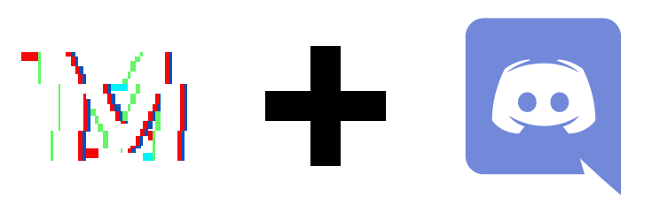

# Discord Mindnight bot

A recreation of [Mindnight](https://store.steampowered.com/app/667870/MINDNIGHT/), a social deduction Steam game based on party games Werewolf and The Resistance, as a Discord bot.

This project is also inspired by [Ratismal's UNO Discord bot](https://github.com/Ratismal/UNO) and [Kevlar's MindWatch using the Overwatch Workshop](https://workshop.codes/TJ7R0)

## Setup

1. Install [Python 3.8](https://www.python.org/downloads/) (+ pip).
2. Install Pipenv (`$ pip install pipenv`).
3. Create venv and install dependencies (`$ pipenv install`).
4. Copy `example.bot.conf` and rename file as `bot.conf`.
5. Edit `bot.conf` to use the token of your bot.

### Emotes

The bot supports custom emotes which can be configured in `bot.conf`.
Their respective images can be found in `assets/`.

1. Upload the emotes to a server your bot is in.
2. Get their ID. You can either:
	* Use the emotes, but prepend \\ so that when you send them they look like "<:emote_name:emote_id>"
	* Get a link to their image (on desktop/web, right click on the emote and select "Copy Link"), paste it somewhere then copy the name of the file at the end (cdn.discordapp.com/emojis/**emote_id**.png)
3. Replace the default IDs in `bot.conf` with the ID of the respective emotes.

### Running

To start the bot, simply run
> `$ pipenv run main.py`

## Disclaimer

The bot is no associated with NoMoon or Mindnight in any way.

All assets are recreations of the original imaginery based on Mindnight's Presskit and gameplay footage.
